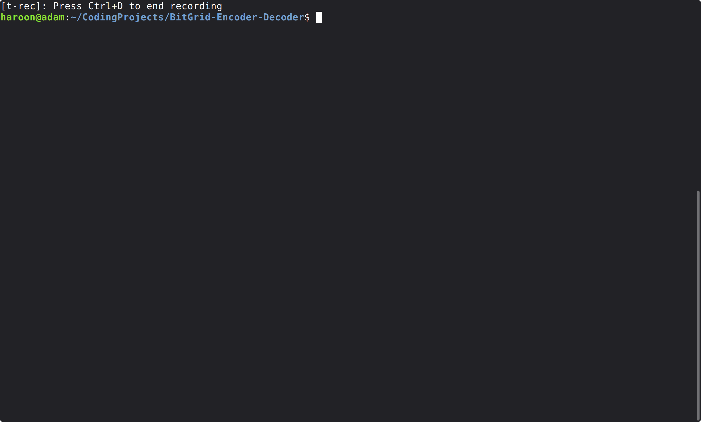

<h1 align="center">BitGrid Encoder/Decoder</h1>

<p align="center">
  A C++ 17 terminal application that encodes text into a custom two-dimensional
  binary format and decodes it with signature, length, and checksum validation.
</p>

<!--
DEMO PLACEHOLDER

Recommended:
1. Create an "assets" folder in the repository.
2. Record a short GIF showing:
   - entering text
   - generating a BitGrid
   - displaying the checksum
   - decoding a BitGrid back into text
3. Save it as assets/bitgrid-demo.gif.
4. Uncomment this:

<p align="center">
  
</p>
-->

## Overview

**BitGrid Encoder/Decoder** is a terminal-based C++ program that converts text
into a custom visual binary representation.

Each byte of the input is represented by eight binary digits. The encoded
payload is combined with a 64-bit metadata header and rendered as a square grid
of filled and shaded Unicode blocks.

The program can also reverse the process. When decoding a BitGrid, it validates
the format signature, checks that the complete payload is present, reconstructs
the original text, and verifies the data against a stored checksum.

## Features

- Encode text into an 8-bit-per-byte binary representation
- Render encoded data as a two-dimensional BitGrid
- Decode BitGrid data back into text
- Store metadata in a custom 64-bit header
- Validate BitGrid input using a format signature and payload length
- Detect data corruption using a 16-bit position-weighted checksum
- Save generated BitGrids to a text file
- Use all functionality through an interactive terminal interface

## BitGrid Format

Every BitGrid contains a **64-bit header** followed by the encoded payload.

| Field | Size | Purpose |
| --- | ---: | --- |
| `HABG` signature | 32 bits | Identifies the BitGrid format |
| Payload length | 16 bits | Stores the number of encoded input bytes |
| Checksum | 16 bits | Provides basic integrity validation |

### Encoding

For example, the text:

```text
Hi
```

is first converted byte by byte:

```text
'H' -> 01001000
'i' -> 01101001
```

producing the payload:

```text
0100100001101001
```

The 64-bit header is prepended to this payload before the complete binary
sequence is rendered into the grid.

### Grid Representation

The program finds the smallest square interior capable of storing the complete
header and payload:

```text
interior size = ceil(sqrt(total encoded bits))
```

A border is then added around the data.

| Grid element | Meaning |
| --- | --- |
| `██` | Binary `1` |
| `▒▒` | Binary `0` |
| `╔ ╗ ╚ ╝ ═ ║` | Grid border |

Any unused cells required to complete the square are filled with `1` blocks.
The payload-length field allows the decoder to ignore this padding.

## Checksum Validation

BitGrid uses a simple position-weighted 16-bit checksum.

For each byte, its numeric value is multiplied by its one-based position. The
results are accumulated modulo `65,536`:

```text
checksum = Σ(byte[i] * (i + 1)) mod 65536
```

During decoding, the program:

1. reads the checksum stored in the header,
2. decodes the payload,
3. calculates a checksum from the decoded data, and
4. compares the two values.

A mismatch indicates that corruption was detected.

> The checksum is designed for basic accidental-error detection. It is not
> a cryptographic hash and should not be used for authentication or security.

## Example

Input:

```text
Hello
```

Output from the current implementation:

```text
╔══════════════════════╗
║▒▒██▒▒▒▒██▒▒▒▒▒▒▒▒██▒▒║
║▒▒▒▒▒▒▒▒██▒▒██▒▒▒▒▒▒▒▒║
║██▒▒▒▒██▒▒▒▒▒▒██████▒▒║
║▒▒▒▒▒▒▒▒▒▒▒▒▒▒▒▒▒▒▒▒▒▒║
║▒▒██▒▒██▒▒▒▒▒▒▒▒▒▒████║
║▒▒▒▒▒▒████▒▒▒▒▒▒██▒▒██║
║▒▒▒▒██▒▒▒▒▒▒▒▒████▒▒▒▒║
║██▒▒██▒▒████▒▒████▒▒▒▒║
║▒▒████▒▒████▒▒▒▒▒▒████║
║▒▒████████████████████║
║██████████████████████║
╚══════════════════════╝
The checksum stored in the bit grid: 1585
The recalculated checksum from the grid data: 1585
```

<!--
SCREENSHOT PLACEHOLDER

A cropped terminal screenshot can replace or supplement the text example above.

Recommended filename:
assets/bitgrid-output.png

Then uncomment:

<p align="center">
  
</p>
-->

## Decoding and Validation

Before returning decoded text, BitGrid verifies:

```text
BitGrid input
     |
     v
Convert blocks to binary
     |
     v
64-bit header present?
     |
     v
Valid HABG signature?
     |
     v
Complete declared payload present?
     |
     v
Decode payload
     |
     v
Stored checksum matches recalculated checksum?
     |
     v
Return decoded text
```

Malformed, incomplete, or corrupted input is rejected rather than silently
decoded as valid data.

## Build and Run

### Requirements

- A C++ compiler
- C++17 mode
- A terminal capable of displaying Unicode characters

The project uses only the C++ standard library and has no external library
dependencies.

### Clone

```bash
git clone https://github.com/P3rsin/BitGrid-Encoder-Decoder.git
cd BitGrid-Encoder-Decoder
```

### Compile

Using GCC:

```bash
g++ -std=c++17 -Wall -Wextra -Wpedantic main.cpp BitGridCodec.cpp -o BitGrid
```

### Run

```bash
./BitGrid
```

## Usage

The program opens an interactive menu:

```text
-------------------------
 BitGrid Encoder/Decoder
-------------------------
[1] Generate a bit grid
[2] View my bit grid
[3] Save my bit grid
[4] Decode a bit grid
[5] About the project
[6] Exit
Choice:
```

**Generate:** enter text to create a BitGrid and view its checksum.

**View:** display the currently stored input and generated BitGrid.

**Save:** write the current BitGrid to `bitGrid.txt`.

**Decode:** paste a BitGrid into the terminal and enter `Done` on a new line
after the final row. The program validates the data before returning the
decoded text.

## Limitations

- The 16-bit length field limits input to **65,535 bytes**.
- The checksum only provides basic error detection.
- Text processing is byte-oriented rather than Unicode-code-point-aware.
- BitGrid is a custom format and is not compatible with QR Code readers.

### Author - Haroon Awan

<!-- Optional:
[GitHub](https://github.com/P3rsin) ·
[LinkedIn](YOUR_LINKEDIN_URL)
-->
